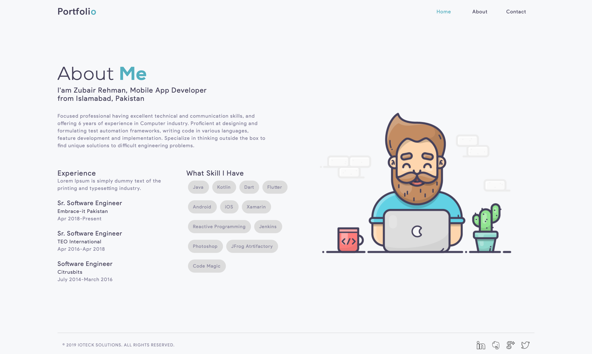

# Portfolio

A portfolio build by using flutter for web.

## Demo

<p>
  
</p>

## How to Create and Deploy
Follow the links below to learn more about how to create and deploy web applications in flutter.

* Flutter For Web: [A Complete Guide to Create & Run a Web Application](https://medium.com/@zubairehman.work/flutter-for-web-c75011a41956)

* Flutter For Web: [A Complete Guide to Deploy a Web Application](https://medium.com/@zubairehman.work/flutter-for-web-a-complete-guide-to-deploy-a-web-application-3fa9463377a8)

## How to Use 

**Step 1:**

Download or clone this repo by using the link below:

```
https://github.com/zubairehman/Portfolio-Demo.git
```

**Step 2:**

Go to project root and execute the following command in console to get the required dependencies: 

``` 
flutter pub get 
```

**Step 3:**

To use the Flutter SDK with the flutter_web preview make sure you have upgraded Flutter to at least v1.5.4 by running flutter upgrade from your machine. Follow the link to learn more about how to configure flutter for web: https://medium.com/@zubairehman.work/flutter-for-web-c75011a41956

**Step 4:**

To run this application simply type in the following command:

```
flutter packages pub global run webdev serve
```

## Folder Structure
Here is the core folder structure which flutter provides.

```
flutter-app/
|- android
|- build
|- ios
|- lib
|- test
```

Here is the folder structure we have been using in this project

```
lib/
|- constants/
|- ui/
|- utils/
|- widgets/
|- main.dart
```

Now, lets dive into the lib folder which has the main code for the application.

```
1- constants - All the application level constants are defined in this directory with-in their respective files. This directory contains the constants for `theme`, `dimentions`, `api endpoints`, `preferences` and `strings`.
2- ui — Contains all the ui of your project, contains sub directory for each screen.
3- util — Contains the utilities/common functions of your application.
4- widgets — Contains the common widgets for your applications. For example, Button, TextField etc.
5- main.dart - This is the starting point of the application. All the application level configurations are defined in this file i.e, theme, routes, title, orientation etc.
```

### Constants

This directory contains all the application level constants. A separate file is created for each type as shown in example below:

```
constants/
|- assets.dart
|- fonts.dart
|- strings.dart
|- text_styles.dart
```

### UI

This directory contains all the ui of your application. Each screen is located in a separate folder making it easy to combine group of files related to that particular screen. All the screen specific widgets will be placed in `widgets` directory as shown in the example below:

```
ui/
|- login
   |- login_screen.dart
   |- widgets
      |- login_form.dart
      |- login_button.dart
```

### Utils

Contains the common file(s) and utilities used in a project. The folder structure is as follows: 

```
utils/
|- encryption
   |- xxtea.dart
|- date
  |- date_time.dart
```

### Widgets

Contains the common widgets that are shared across multiple screens. For example, Button, TextField etc.

```
widgets/
|- app_icon_widget.dart
|- empty_app_bar.dart
|- progress_indicator.dart
```

### Main

This is the starting point of the application. All the application level configurations are defined in this file i.e, theme, routes, title, orientation etc.

```
import 'package:flutter_web/material.dart';
import 'package:portfolio/ui/home.dart';

import 'package:portfolio/utils/screen/screen_utils.dart';

void main() {
  runApp(MyApp());
}

class MyApp extends StatelessWidget {

  @override
  Widget build(BuildContext context) {

    return MaterialApp(
      debugShowCheckedModeBanner: false,
      theme: ThemeData(
          brightness: Brightness.light,
          primaryColorBrightness: Brightness.light,
          accentColorBrightness: Brightness.light
      ),
      home: MyAppChild(),
    );
  }
}

class MyAppChild extends StatefulWidget {

  @override
  _MyAppChildState createState() => _MyAppChildState();
}

class _MyAppChildState extends State<MyAppChild> {
  @override
  Widget build(BuildContext context) {
    // instantiating ScreenUtil singleton instance, as this will be used throughout
    // the app to get screen size and other stuff
    ScreenUtil.instance = ScreenUtil.getInstance()..init(context);
    return HomePage();
  }
}
```

If you liked my work, don’t forget to ⭐ star the repo to show your support.
